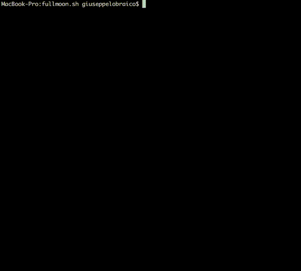

# fullmoon.sh

## Specs

*Given that I have a partner with their period aligned with the moon's cycle, in order to better schedule and both enjoy our time (especially if we live far away), I want to know in advance the full moon dates of the current and/or next year(s).*

## Requirements

You need to have [`jq`](https://stedolan.github.io/jq/) installed on your local machine.

## Example

**A `fullmoon.ics` iCalendar file is automatically generated in the script folder at every execution.**

## Notes

This bash script queries the ["Astronomical Applications API v2.0.1"](http://aa.usno.navy.mil/data/docs/api.php#phase) from the [Astronomical Applications Department of the U.S. Naval Observatory](http://aa.usno.navy.mil/index.php) (which I find more accurate than writing your own calculations). Be polite.

## Why not Google?

I need to feel useful on a Sunday afternoon.

**And I wanted to demonstrate that you don't need another scripting language when you have bash, sometimes.**

## License: MIT

Copyright (C) 2017 Giuseppe Lobraico

Permission is hereby granted, free of charge, to any person obtaining a copy of this software and associated documentation files (the "Software"), to deal in the Software without restriction, including without limitation the rights to use, copy, modify, merge, publish, distribute, sublicense, and/or sell copies of the Software, and to permit persons to whom the Software is furnished to do so, subject to the following conditions:

The above copyright notice and this permission notice shall be included in all copies or substantial portions of the Software.

THE SOFTWARE IS PROVIDED "AS IS", WITHOUT WARRANTY OF ANY KIND, EXPRESS OR IMPLIED, INCLUDING BUT NOT LIMITED TO THE WARRANTIES OF MERCHANTABILITY, FITNESS FOR A PARTICULAR PURPOSE AND NONINFRINGEMENT. IN NO EVENT SHALL THE AUTHORS OR COPYRIGHT HOLDERS BE LIABLE FOR ANY CLAIM, DAMAGES OR OTHER LIABILITY, WHETHER IN AN ACTION OF CONTRACT, TORT OR OTHERWISE, ARISING FROM, OUT OF OR IN CONNECTION WITH THE SOFTWARE OR THE USE OR OTHER DEALINGS IN THE SOFTWARE.

